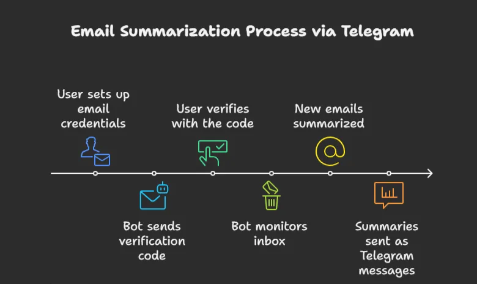
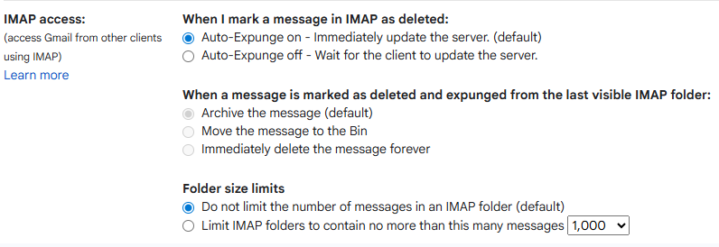

# Readme

## Concept

The younger generation today is often new to traditional emails and more accustomed to instant messaging platforms like Telegram or standard text messages for communicating event updates and important information. This creates a challenge for organizations and individuals who still rely on formal email communication. To address this, we aim to bridge the gap by converting emails into easy-to-read text formats and, conversely, transforming text messages into proper email formats for sending. This approach not only makes communication more accessible and engaging for the younger generation but also ensures that the older generation, who are more familiar with formal email etiquette, can continue to receive messages in the format they expect.

### Key Features:

1. **Email Integration**: Supports both Gmail and Outlook via IMAP/SMTP
2. **LLM Integration**: Configurable API endpoint for any LLM provider
3. **Telegram Bot**: Full bot with commands and message handling
4. **Security**: Email verification with time-limited codes
5. **Database**: SQLite for storing user data and processed emails
6. **Email Summaries**: Converts emails to text-message-like summaries

### Flow of code/bot:

<p align="left">
      
    </p>

## Running the code

### Quick code tree

```python
TELEMAIL
├── images
│   ├── image.png
│   └── image2.png
├── tools
│   ├── __pycache__/
│   ├── bot.py
│   ├── config.py
│   ├── database_manager.py
│   ├── email_service.py
│   ├── llm_service.py
│   ├── models.py
│   ├── monitoring_manager.py
│   ├── prompts.py
│   ├── schema.sql
│   ├── telegram_handlers.py
│   └── verification_service.py
├── .env
├── .env.example
├── .gitignore
├── main.py
├── readme.md
└── requirements.txt
```

### To start clone the repo with the following command.

```python
git clone https://github.com/ZKliio/TeleMail.git
```

### Configuration Needed in code:

1. Copy the .env.example file provided and rename it to .env 
2. **Telegram Bot**: Get token from @BotFather
3. **LLM API**: Update the `Config` class with your LLM provider details
4. Optional step create and open a venv
	
	```python
	python -m venv venv
	venv\Scripts\activate
	```
	
5. Install dependencies in venv: 
	
	```python
	pip install -r requirements.txt
	```
	

### Running the code

If you have cloned the repo run

```python
py main.py
```

## User side setup
- User needs to allow IMAP access with auto-expunge on
<p align="left">
      
    </p>

### Authentication Security:
- User sets up their Gmail with 2FA and acquire an App password
	- They will copy this 16 digit code to later be used in their tele bot set up
- Users verify email ownership with codes sent to their email
	- Verification codes expire in 5 minutes
	- Only verified users receive summaries

### Tele bot

The name of the Tele bot is TeleMail which can be searched in Telegram or using this link it would direct the user to the bot as well, [http://t.me/MailTele0929Bot](http://t.me/MailTele0929Bot) 

1. User will `/Start` to start their bot for the first time 
	
	> Subsequently when the user enters the bot when the same code is running the locally saved database
	> 
2. Next step is to `/setup` to start configuring their user id current supported type is Gmail. Outlook and more are in progress.
	
	> @gmail.com xxxx xxxx xxxx xxxx 
	above is the sample setup from the user side the x’s represent the app password
	> 
3. `/verify` to verify the code sent to their Gmail to finally authenticate and start monitoring
4. `/status` to check their connection status
5. `/clear` to clear the screen incase there are too many messages.

## Next Steps:

1. Use Oauth2 to ease verification on User’s end which would cut down the setup time drastically with a simple less than a minute set up
2. Add multiple mail methods to be sent into the Tele bot
3. Give the user the best experience to read and send mails
